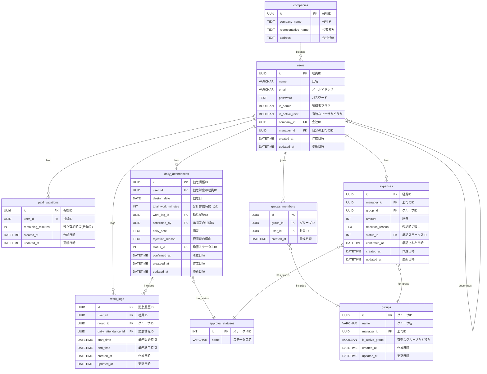

```mermaid
 erDiagram
		%% 会社テーブル
	companies {
			UUId id PK "会社ID"
			TEXT company_name "会社名"
			TEXT representative_name "代表者名"
			TEXT address "会社住所"	
	}
		
		%% 社員テーブル
    users {
        UUID id PK "社員ID"
        VARCHAR name "氏名"
        VARCHAR email "メールアドレス"
        TEXT password "パスワード"
        BOOLEAN is_admin "管理者フラグ"
        BOOLEAN is_active_user "有効なユーザかどうか"
        UUID company_id FK "会社ID"
        UUID manager_id FK "自分の上司のID"
        DATETIME created_at "作成日時"
        DATETIME updated_at "更新日時"
    }
    
    %% 有給テーブル
    paid_vacations {
		    UUId id PK "有給ID"
		    UUID user_id FK "社員ID"
		    INT remaining_minutes "残り有給時間(分単位)"
		    DATETIME created_at "作成日時"
        DATETIME updated_at "更新日時"
    }
    
		%% 勤怠情報テーブル
    daily_attendances {
        UUID id PK "勤怠情報ID"
        UUID user_id FK "勤怠対象の社員ID"
        DATE closing_date "勤怠日"
        INT total_work_minutes "合計労働時間（分）"
        UUID work_log_id FK "勤怠履歴ID"
        UUID confirmed_by FK "承認者の社員ID"
        TEXT daily_note "備考"
        TEXT rejection_reason "否認時の理由"
        INT status_id FK "承認ステータスID"
        DATETIME confirmed_at "承認日時"
        DATETIME createed_at "作成日時"
        DATETIME updated_at "更新日時"
    }
		
		%% 勤怠履歴テーブル
    work_logs {
        UUID id PK "勤怠履歴ID"
        UUID user_id FK "社員ID"
        UUID group_id FK "グループID"
        UUID daily_attendance_id FK "勤怠情報ID"
        DATETIME start_time "業務開始時間"
        DATETIME end_time "業務終了時間"
        DATETIME created_at "作成日時"
        DATETIME updated_at "更新日時"
    }
    
    %% グループテーブル
    groups {
        UUID id PK  "グループID"
        VARCHAR name "グループ名"
        UUID manager_id FK "上司ID"
        BOOLEAN is_active_group "有効なグループかどうか"
        DATETIME created_at "作成日時"
        DATETIME updated_at "更新日時"
    }
    
    %% グループとUserの中間テーブル
    groups_members {
        UUID id PK 
        UUID group_id FK "グループID"
        UUID user_id FK "社員ID"
        DATETIME created_at "作成日時"
    }
    
    %%  経費テーブル
    expenses {
	    UUID id PK  "経費ID"
	    UUID manager_id FK "上司のID"
	    UUID group_id FK  "グループID"
	    INT amount "経費"
      TEXT rejection_reason "否認時の理由"
      INT status_id FK "承認ステータスID"
      DATETIME confirmed_at "承認された日時"
      DATETIME created_at "作成日時"
      DATETIME updated_at "更新日時"
    }
    
    %% 承認ステータス共通テーブル
    approval_statuses {
        INT id PK "ステータスID"
        VARCHAR name "ステータス名"
		}

    %% リレーション定義
    companies ||--o{ users : belongs
    users ||--o{ daily_attendances : has
    users ||--o{ work_logs : logs
    users ||--o{ paid_vacations : has
    users ||--o{ expenses : has
    users ||--o{ groups_members : joins
    users ||--o{ users : supervises

    daily_attendances ||--o{ work_logs : includes
    daily_attendances }o--|| approval_statuses : has_status
    
    groups_members }o--|| groups : includes

    expenses }o--|| approval_statuses : has_status
    expenses }o--|| groups : for_group
```
